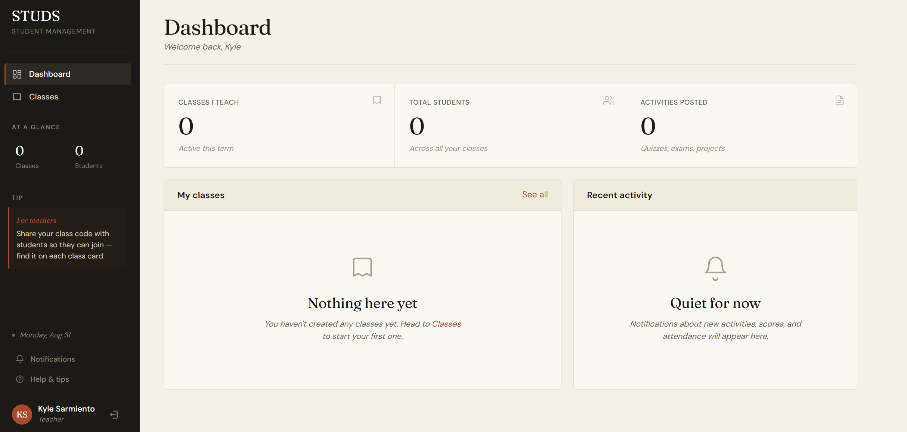
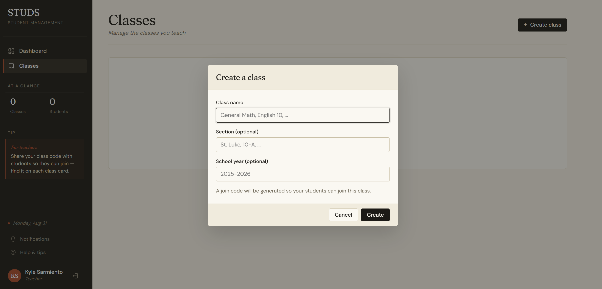
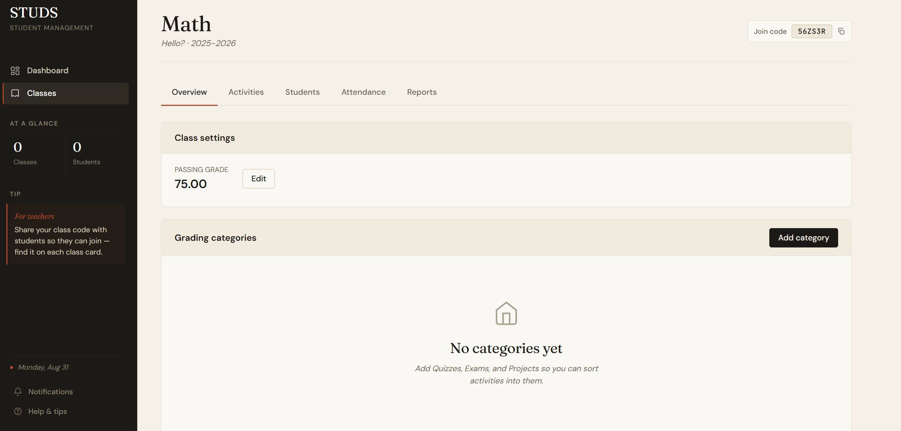
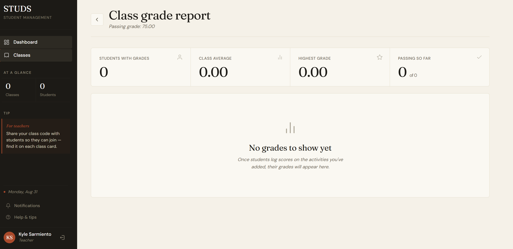

# Studs

Student–teacher management that runs outside the LMS your school already has. Classes, students, attendance, activities and scores in one place, without waiting on IT to provision anything.

**Live: [studs-eight.vercel.app](https://studs-eight.vercel.app/)**

---



## What's in it

| Page | Does |
|---|---|
| `dashboard` | Overview across classes |
| `classes` / `classDetail` | Class list, join code, grading categories |
| `students` | Roster management |
| `attendance` | Per-day attendance capture, history for students |
| `activities` | Activities and their categories |
| `reports` | Grades, class averages, pass/fail summaries |
| `login` | Supabase auth |

Teachers create a class and get a join code. Students enter the code, log their own scores against each activity, and see a running grade. Teachers can override any score, mark attendance, and read the class report.

<table>
<tr>
<td width="50%"></td>
<td width="50%"></td>
</tr>
</table>



## Architecture

Vite and plain JavaScript — no framework. The structure is deliberate rather than incidental:

```
src/
  data/          one repository module per entity — the only place Supabase is touched
    supabaseClient.js  cache.js
    authRepo.js        usersRepo.js       classesRepo.js
    enrollmentsRepo.js categoriesRepo.js  activitiesRepo.js
    scoresRepo.js      attendanceRepo.js  notificationsRepo.js
  services/      use-cases and business rules; orchestrate repos, never touch the DOM
    userService.js     classService.js    enrollmentsService.js
    categoryService.js activityService.js scoreService.js
    attendanceService.js gradeService.js  notificationsService.js
    gradeEngine.js     gradeEngine.test.js
  pages/         one module per route
  components/    dom.js, modal.js, notify.js, errors.js
  layout/        shell.js — app shell and navigation
  main.js        entry point
  router.js      hash router
```

Every page talks to a service or a repository, never to Supabase directly. That keeps the query layer in one place and makes the pages easy to read.

`gradeEngine.js` is the exception worth calling out: it is pure functions with no I/O, so the grading formula can be tested without a database.

```bash
npm test    # 14 assertions against the grade engine
```

## Grading

Weighted, on a 0–100 scale, and configurable per class rather than hardcoded:

- **Category weights** — any split, as long as it totals 100
- **Drop lowest N** — per category, applied only when there are more scores than N
- **Extra credit** — the raw score counts toward the numerator, the max does not count toward the denominator
- **Passing grade** — per class, defaults to 75

## Database

PostgreSQL on Supabase. Schema and policies live in `supabase/migrations`, applied in order.

Authorization is Row Level Security, not client-side checks: teachers reach only their own classes, students only the classes they joined and their own scores. Cross-cutting reads that would otherwise recurse through RLS (resolving a join code, seeing a classmate's name) go through `SECURITY DEFINER` helpers that check membership first.

Profile rows are created by a trigger on `auth.users`, so signup does not depend on the client holding a session at the moment it writes.

## Stack

Vite · JavaScript · Supabase · PostgreSQL

## Running locally

```bash
git clone https://github.com/kkyleee23/Studs.git
cd Studs
npm install
cp .env.example .env    # add your own Supabase project URL and anon key
npm run dev
```

`npm run build` produces a production bundle; `npm run preview` serves it.

You will also need a Supabase project with the migrations in `supabase/migrations` applied in order.

## Notes

The Supabase anon key is designed to be public — it ships to the browser. Access is expected to be enforced by Row Level Security policies on the database, not by hiding the key.

## License

Not open source. The source is published so it can be read and evaluated; copying, modifying, redistributing or deploying it is not permitted. See [LICENSE](LICENSE).
